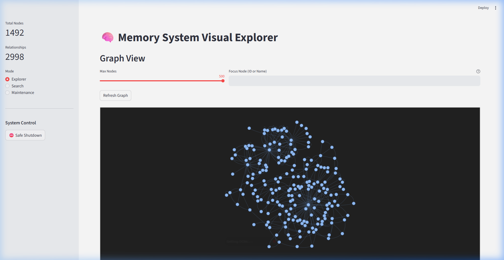

# Claude Memory MCP Server

[](LICENSE)
[]()
[-blue)]()

**Give Claude persistent memory across conversations.**

An MCP server that gives Claude long-term memory using a knowledge graph + vector search hybrid. Claude can store entities, observations, and relationships — then recall them semantically across sessions. An autonomous background agent ("The Librarian") periodically clusters and synthesizes memories into higher-order concepts.



## Why I Built This

Claude is brilliant but forgets everything between conversations. Every new chat starts from scratch — no context, no continuity, no accumulated understanding. I wanted Claude to *remember* me: my projects, preferences, breakthroughs, and the connections between them. Not a flat chat history dump, but a living knowledge graph that grows richer over time.

## What It Does

| Capability | How It Works |
|------------|-------------|
| **Store memories** | Creates entities (people, projects, concepts) with typed observations |
| **Semantic search** | Finds memories by meaning, not just keywords — "that thing about distributed systems" works |
| **Graph traversal** | Follows relationships between memories — "what's connected to Project X?" |
| **Time travel** | Queries your memory graph at any point in time — "what did I know last Tuesday?" |
| **Auto-clustering** | Background agent discovers patterns and creates concept summaries |
| **Session tracking** | Remembers conversation context and breakthroughs |

## Quick Start

### 1. Start the Services

```bash
docker-compose up -d
```

This spins up 4 containers:
- **FalkorDB** (knowledge graph) on port 6379
- **Qdrant** (vector search) on port 6333
- **Embedding API** (sentence-transformers) on port 8001
- **Streamlit Dashboard** on port 8501

### 2. Connect Claude Desktop

Add this to your `claude_desktop_config.json`:

```json
{
  "mcpServers": {
    "claude-memory": {
      "command": "powershell.exe",
      "args": ["-ExecutionPolicy", "Bypass", "-File", "path/to/scripts/run_mcp_server.ps1"],
      "env": {
        "PYTHONPATH": "path/to/src",
        "FALKORDB_HOST": "localhost",
        "FALKORDB_PORT": "6379",
        "FALKORDB_PASSWORD": "your-password",
        "QDRANT_HOST": "localhost",
        "QDRANT_PORT": "6333",
        "EMBEDDING_API_URL": "http://localhost:8001"
      }
    }
  }
}
```

See `mcp_config.example.json` for a working template.

### 3. Talk to Claude

Once connected, Claude automatically has access to 30 memory tools. Just talk naturally:

> "Remember that I'm working on a Rust project called Atlas and I prefer functional patterns."

> "What do you know about my learning style?"

> "Show me everything connected to the Atlas project."

## MCP Tools (Top 10)

| Tool | What It Does |
|------|-------------|
| `create_entity` | Store a new person, project, concept, or any typed node |
| `add_observation` | Attach a fact or note to an existing entity |
| `search_memory` | Semantic + graph hybrid search across all memories |
| `get_hologram` | Get an entity with its full connected context (neighbors, observations, relationships) |
| `create_relationship` | Link two entities with a typed, weighted edge |
| `get_neighbors` | Explore what's directly connected to an entity |
| `point_in_time_query` | Query the graph as it existed at a specific timestamp |
| `record_breakthrough` | Mark a significant learning moment for future reference |
| `run_librarian_cycle` | Manually trigger the autonomous clustering and synthesis agent |
| `graph_health` | Get stats on your memory graph — node counts, edge density, orphans |

All 30 tools are documented in [docs/MCP_TOOL_REFERENCE.md](docs/MCP_TOOL_REFERENCE.md).

## Architecture

```
┌─────────────────────────────────────────────┐
│              Claude Desktop                  │
│         (MCP Client via stdio/SSE)           │
└────────────────┬────────────────────────────┘
                 │
┌────────────────▼────────────────────────────┐
│           MCP Server (FastMCP)               │
│    30 tools · Service-Repository pattern     │
├──────────────┬───────────────┬───────────────┤
│  FalkorDB    │    Qdrant     │  Embedding    │
│  (Graph DB)  │  (Vectors)    │  (BGE-M3)     │
│  Cypher      │  HNSW Index   │  1024d        │
└──────────────┴───────────────┴───────────────┘
```

- **Graph Layer**: FalkorDB stores entities, relationships, and observations as a Cypher-queryable knowledge graph
- **Vector Layer**: Qdrant stores 1024d embeddings for semantic similarity search
- **Hybrid Search**: Queries hit both layers and merge results using spreading activation
- **Autonomous Agent**: "The Librarian" runs DBSCAN clustering to discover concept groups and synthesize summaries

## Quality

This isn't a weekend hack. It's tested like production software:

- **904 unit tests** across 66 files, 0 failures, 0 skipped
- **Mutation testing** — 3-evil/1-sad/1-happy per function
- **Property-based testing** — 28 Hypothesis properties
- **Fuzz testing** — 30K+ inputs, 0 crashes
- **Static analysis** — mypy strict mode (0 errors), ruff (0 errors)
- **Security audit** — Cypher injection audit, credential scanning
- **Dragon Brain Gauntlet** — 20-round automated quality audit, **A- (95/100)**

Full gauntlet results: [GAUNTLET_RESULTS.md](docs/GAUNTLET_RESULTS.md)

## Documentation

| Doc | What's In It |
|-----|-------------|
| [User Manual](docs/USER_MANUAL.md) | How to use each tool with examples |
| [MCP Tool Reference](docs/MCP_TOOL_REFERENCE.md) | API reference: all 30 tools, params, return shapes |
| [Architecture](docs/ARCHITECTURE.md) | System design, data model, component diagram |
| [Maintenance Manual](docs/MAINTENANCE_MANUAL.md) | Backups, monitoring, troubleshooting |
| [Runbook](docs/RUNBOOK.md) | 10 incident response recipes |
| [Code Inventory](docs/CODE_INVENTORY.md) | File-by-file manifest |
| [Gotchas](docs/GOTCHAS.md) | Known traps and edge cases |

## Local Development

Requires **Python 3.12+**.

```bash
# Install
pip install -e ".[dev]"

# Run tests
tox -e pulse

# Run server locally
python -m claude_memory.server

# Run dashboard
streamlit run src/dashboard/app.py
```

### Claude Code CLI

```bash
claude mcp add claude-memory -- python -m claude_memory.server
```

## Contributing

See [CONTRIBUTING.md](CONTRIBUTING.md) for testing policy, code style, and how to submit changes.

## License

[MIT](LICENSE)
