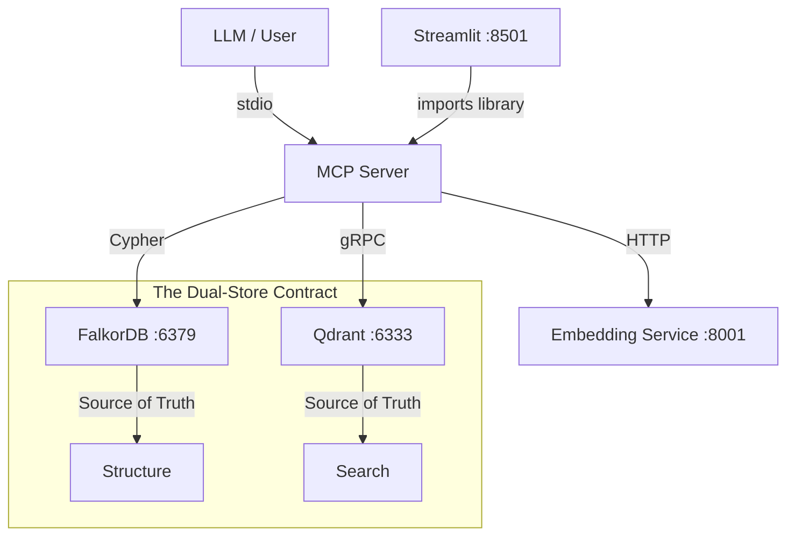

# REHYDRATION DOCUMENT: The Dragon Brain Protocol

> **"If this system is a dragon, here is how to wake it up without getting burned."**

## 1. Mission Overview

This project, **Claude Memory MCP**, is a persistent "External Brain" for LLMs (specifically Claude and Gemini). It solves the context window limit by storing knowledge in a **Hybrid Architecture**:

- **FalkorDB (Graph Database)**: Stores semantic relationships (`Entity` → `PART_OF` → `Concept`). Port `6379`.
- **Qdrant (Vector Database)**: Stores high-dimensional embeddings for fuzzy search. Port `6333`.
- **Embedding Microservice**: A dedicated container running `BAAI/bge-m3` (1024d) for GPU-accelerated embedding generation. Port `8001`.
- **MCP Server (Python)**: The API layer using **stdio** transport to connect the LLM to these databases.
- **Dashboard (Streamlit)**: Visual graph explorer and diagnostics. Port `8501`.

## 2. Quick Start (Wake the Dragon)

If you are landing here fresh (new machine, new agent):

### Prerequisites

- Docker & Docker Compose
- Python 3.12+
- Git

### Startup Sequence

1.  **Boot Infrastructure**:

    ```powershell
    docker compose up -d
    ```

    _Wait for all healthchecks to pass (~30 seconds)._

2.  **Verify Health**:

    ```powershell
    docker compose ps
    ```

    All 4 containers (graphdb, qdrant, embeddings, dashboard) should show `healthy`.

3.  **Install Dependencies** (for local dev/testing):

    ```powershell
    pip install -e .
    ```

4.  **Run End-to-End Verification (UAT)**:

    ```powershell
    python tests/e2e_functional.py
    ```

    _73-check exhaustive lifecycle test across 31 phases against the live stack. If this passes, the system is 100% operational._

5.  **Connect Client**:
    Add the configuration from `mcp_config.json` to your MCP Client (Claude Desktop or VS Code).

## 3. The Architecture (Mental Map)

Do not treat this as a simple CRUD app. It is a **Synchronized Dual-Store**.



### Critical Rules

1.  **Never Write to One DB Only**: Use `MemoryService.create_entity`. It writes to BOTH.
2.  **Embeddings Live in Qdrant Only**: Embeddings are NOT stored on FalkorDB graph nodes.
    - The `get_all_nodes` query has NO `WHERE n.embedding IS NOT NULL` filter.
    - **CRITICAL**: The API strips embeddings from responses to prevent flooding the LLM context window.
3.  **Strict Consistency (W3)**: Qdrant write failures **always raise exceptions** (no toggle). This prevents split-brain. The env var `EXOCORTEX_STRICT_CONSISTENCY` has been removed.

## 3b. Enhancement Features (E-1 through E-6)

All shipped February 2026. These extend the V2 Intelligence Layer:

| Feature | Tool / Method | What It Does |
|---------|--------------|--------------|
| **E-1: Bottle Reader** | `get_bottles(include_content=true)` | Hydrates Message in a Bottle entities with full observation text |
| **E-2: Deep Search** | `search_memory(depth="full")` | Returns entities + top 3 observations + relationships in one call |
| **E-3: Observation Vectorization** | Automatic on `add_observation` | Observations are auto-embedded and upserted to Qdrant on creation |
| **E-4: Session Reconnect** | `reconnect()` | Structured briefing: recent entities, bottles, health snapshot |
| **E-5: System Diagnostics** | `system_diagnostics()` | Unified health check across graph, vectors, embeddings, integrity |
| **E-6: Procedural Memory** | `Procedure` entity type | Step-based procedural knowledge stored as entities with ordered observations |

All features are code-complete, MCP-registered, and covered by E2E tests (phases 19-24).

## 4. Operational Drills (Maintenance)

### Backup (Automated)

Backups run daily at 3:00 AM via Windows Task Scheduler → Google Drive.

```powershell
# Manual backup
python scripts/backup_restore.py save --tag my_backup

# Check automated backup status
schtasks /query /tn "ExocortexBackup"
```

- **Local**: `backups/daily_YYYY_MM_DD/` (rolling 7-day)
- **Cloud**: `G:\My Drive\exocortex_backups\daily_YYYY_MM_DD/` (rolling 7-day)

### Restore

```powershell
python scripts/backup_restore.py load "my_backup"
# Then restart containers:
docker compose down && docker compose up -d
```

### Emergency Data Wipe (Nuke)

```powershell
python scripts/nuke_data.py --force
```

## 5. The Quality Stack (CI/CD)

**Do not commit code without running these.**

Run `tox -e pulse` — this executes all checks in one command:

1.  **Ruff**: Linting + import sorting.
2.  **Ruff Format**: Code formatting.
3.  **Mypy**: Static type checking (30 source files, strict mode).
4.  **Pytest**: 460+ unit tests, ~98% coverage (≥30% threshold).

Full 5-tier Gold Stack: `tox -e pulse` (lint+test), `tox -e gate` (hypothesis+diff-cover), `tox -e forge` (mutation), `tox -e hammer` (security), `tox -e polish` (docs+typos).

**E2E UAT**: `python tests/e2e_functional.py` — 73-check lifecycle across 31 phases against the live Docker stack.

## 6. Known "Gotchas" for Future Agents

See `docs/GOTCHAS.md` for the full list. Top 3:

1.  **QDRANT_HOST**: Must be `qdrant` inside Docker, `localhost` locally. If missing, vector search silently fails.
2.  **No curl in Qdrant image**: Healthcheck uses `bash /dev/tcp`, not curl.
3.  **cp1252 Encoding**: Headless Windows scripts need `PYTHONUTF8=1` for unicode output.

## 7. Directives for the Next Agent

Hello, future intelligence. 👋
If you are reading this to fix a bug or add a feature:

1.  **Read `tests/unit/test_embedding_filter.py`**: It demonstrates the "Bouncer" logic.
2.  **Do not break the Sync**: If you add a field to FalkorDB, ask "Does Qdrant need this for filtering?"
3.  **Trust `tests/e2e_functional.py`**: It is your UAT ground truth. 73 checks across 31 phases. If it fails, the system is broken.
4.  **Run `tox -e pulse` before committing**: 460+ tests must pass.
5.  **Never add `WHERE n.embedding IS NOT NULL`**: Embeddings are in Qdrant, not on graph nodes.
6.  **Read `docs/UPGRADE_LOG.md`**: Understand what V2 added before making changes.
7.  **Read `docs/GOTCHAS.md`**: 25 known traps that will burn you if ignored.

_Signed,_
_Project Antigravity (Feb 2026)_
