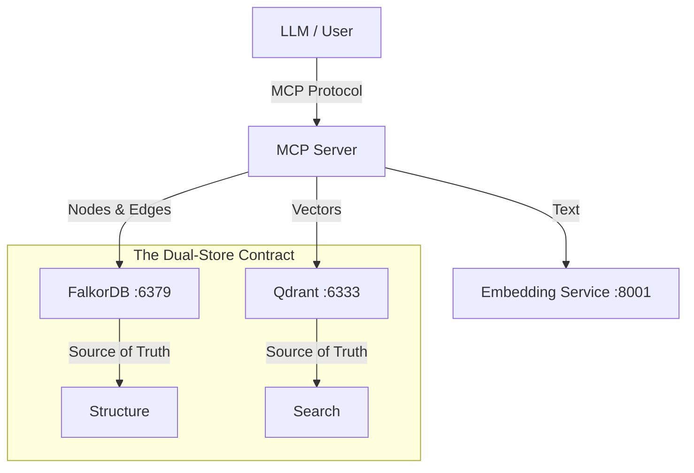

# REHYDRATION DOCUMENT: The Dragon Brain Protocol

> **"If this system is a dragon, here is how to wake it up without getting burned."**

## 1. Mission Overview

This project, **Claude Memory MCP**, is a persistent "External Brain" for LLMs (specifically Claude and Gemini). It solves the context window limit by storing knowledge in a **Hybrid Architecture**:

- **FalkorDB (Graph Database)**: Stores semantic relationships (`Entity` -> `PART_OF` -> `Concept`). port `6379`.
- **Qdrant (Vector Database)**: Stores high-dimensional embeddings for fuzzy search. port `6333`.
- **Embedding Microservice**: A dedicated container running `sentence-transformers/all-MiniLM-L6-v2` to unify embedding logic. port `8001`.
- **MCP Server (Python)**: The API layer that connects the LLM to these databases.

## 2. Quick Start (Wake the Dragon)

If you are landing here fresh (new machine, new agent):

### Prerequisites

- Docker & Docker Compose
- Python 3.10+
- Git

### startup Sequence

1.  **Boot Infrastructure**:

    ```bash
    docker-compose up -d
    ```

    _Wait 10 seconds for services to healthy check._

2.  **Install Dependencies**:

    ```bash
    pip install -e .
    ```

3.  **Run End-to-End Verification**:

    ```bash
    python scripts/final_check.py
    ```

    _If this passes, the system is 100% operational._

4.  **Connect Client**:
    Add the configuration from `claude_desktop_config.json` (root dir) to your MCP Client (Claude Desktop or similar).

## 3. The Architecture (Mental Map)

Do not treat this as a simple CRUD app. It is a **Synchronized Dual-Store**.



### Critical Rules

1.  **Never Write to One DB Only**: Use `MemoryService.create_entity`. It writes to BOTH.
2.  **Embeddings are Heavy**: We store embeddings in FalkorDB (for clustering) and Qdrant (for search).
    - **CRITICAL**: The API strips embeddings from `get_hologram` responses to prevent flooding the LLM context window. (See `tools.py` logic).

## 4. Operational Drills (Maintenance)

### Backup (The "Paranoid" Protocol)

We use a custom script that forces DB persistence (`SAVE`) before copying.

```bash
python scripts/backup_restore.py save --tag my_backup
```

- **Location**: `backups/my_backup/` containing `dump.rdb` (Graph) and `qdrant_data.tar.gz`.

### Restore

```bash
python scripts/backup_restore.py restore --tag my_backup
```

- **Warning**: This requires restarting Docker containers to pick up the new volume data.

### Emergency Data Wipe (Nuke)

If data is corrupted or you want a fresh start:

```bash
python scripts/nuke_data.py --force
```

### Disk Hygiene

Docker images and build cache accumulate fast.

```powershell
./scripts/docker_cleanup.ps1
```

## 5. The "Mercenary" Checks (CI/CD)

**Do not commit code without running these.**

1.  **Pre-Commit**: `ruff`, `black`, `isort`, `mypy`.
    - _Note_: If `mypy` is too strict, fix the types. Do not bypass it.
2.  **Unit Tests**: `pytest tests/`
3.  **E2E Test**: `python scripts/final_check.py`

## 6. Known "Gotchas" for Future Agents

- **Context Flooding**: FalkorDB nodes contain a 1024-float array `embedding`. **NEVER** return this raw array to the LLM. Always `pop("embedding", None)` in the Tool layer.
- **Docker Volumes on Windows**: Binding to `%cd%` can be finicky in PowerShell. Use absolute paths or `${PWD}`.
- **Librarian Agent**: This is a background process (`heal_graph.py` logic) that clusters nodes. It relies on embeddings existing in the Graph DB. Do not delete them from the DB, just hide them from the API.

## 7. Directives for the Next Agent

Hello, future intelligence. 👋
If you are reading this to fix a bug or add a feature:

1.  **Read `tests/unit/test_embedding_filter.py`**: It demonstrates the "Bouncer" logic.
2.  **Do not break the Sync**: If you add a field to FalkorDB, ask "Does Qdrant need this for filtering?"
3.  **Trust `final_check.py`**: It is your ground truth. If it fails, the system is broken.

_Signed,_
_Project Antigravity (Jan 2026)_
