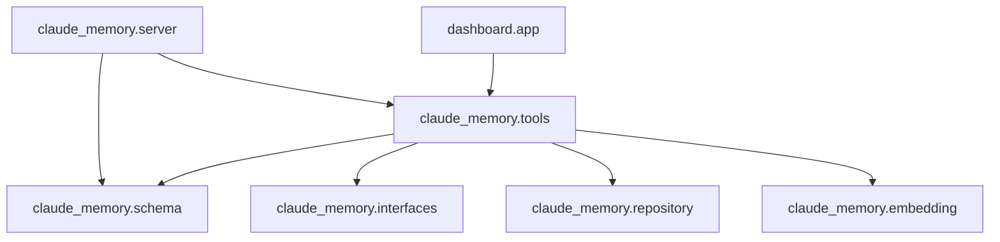
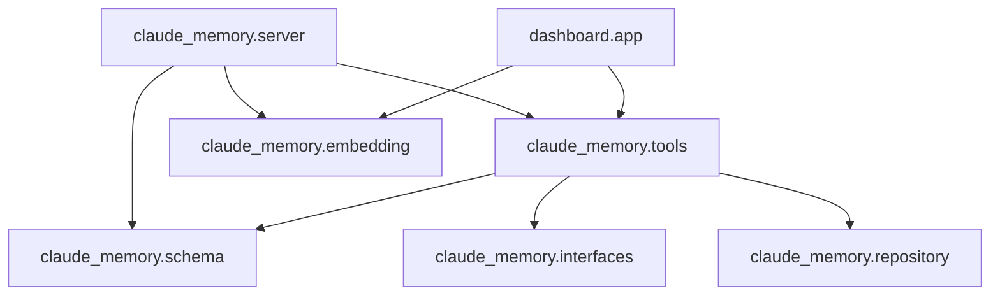

# Dependency Analysis (Final Audit)

**Status**: Highly Decoupled.

## Current Graph

## Observations

1.  **Strict Layering**: No cycles.
    - `Schema` is at the bottom (Pure Data).
    - `Repository` handles Persistence.
    - `Tools` (Service) handles Orchestration.
    - `Server` handles Protocol (MCP).
2.  **Lazy Dependency detected**: `tools --> embedding`.
    - **Why**: `MemoryService.__init__` imports `EmbeddingService` if not provided.
    - **Optimization**: To fully decouple, we can remove this default and make `server.py` and `app.py` responsible for instantiation.
    - **Benefit**: `tools.py` becomes purely abstract regarding embedding.

## Simplification Opportunities

1.  **Remove Default Embedder**: Force injection in `MemoryService`.
    - `server.py` and `dashboard/app.py` must instantiate `EmbeddingService`.
    - Result: `tools.py` no longer depends on `torch`/`sentence-transformers` _at all_, even lazily.
2.  **Mypy Strictness**:
    - The "Persistent Errors" are a conflict between `FastMCP`'s untyped decorators and strict Mypy settings.
    - **Action**: Add explicit type casts or wrapper functions to isolate untyped libs.

## Strategic Decision

> [!CHECK] **COMPLETED**: Simplification #1 Executed.
> We have successfully severed the hard dependency between `tools` and `embedding`.
> `MemoryService` now requires dependency injection.
> `tools.py` is now pure orchestration logic with zero ML dependencies.

## Resulting Graph (Current State)

**Key Change:** `claude_memory.tools` NO LONGER depends on `claude_memory.embedding`.

- `embedding` is injected from `server` or `app`.
- This ensures the core logic remains lightweight and testable without Torch overhead.
